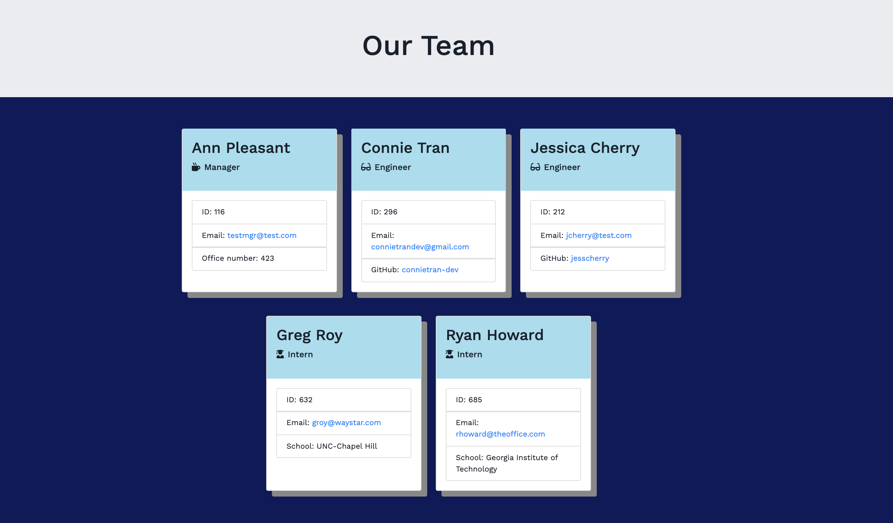
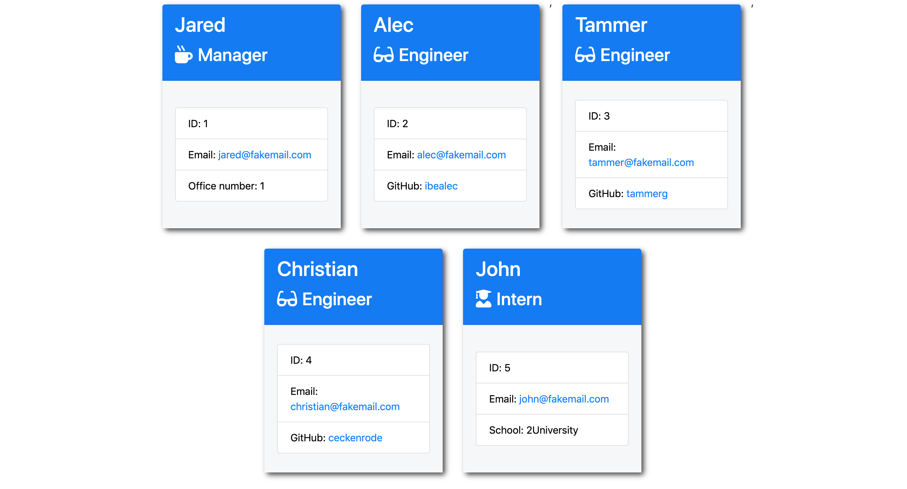

# HW 10 OOP: Node.js Team Profile Generator

## Overview

This is a Node.js command line application that takes in user input for details regarding different employees or managers to generate a team profile page with HTML.

Testing is a key element of this application to ensure proper functionality by using a collection of Jest unit tests.




## Usage Instructions

1. User Inputs

The CLI will prompt the user for information regarding the team manager and then proceed with prompts for other team members.  This app allows any amount of team members and various titles for the members.  All inputs are validated to make sure that it's in the correct format.

2. Team Page Output

After user has inputted information for the team and presses submit, the application will generate an HTML file named 'index' inside the 'docs/' directory that displays a styled team roster based on the user input.  Each team member will display their name, title, ID, and title-specific property.


![Gif demo of team-page-generator CLI]

## Installation

1. Run `npm install` or `npm i` to install npm package dependencies (inquirer, jest)
2. Run `npm start` which will start the application and begin with inquirer prompts
3. To run tests, enter `npm test`


## Folder Structure

The folder structure of the application is as follows:

```
docs/          // Rendered HTML output that will appear on GitHub pages
lib/           // Employee classes as well as helper code to generate HTML
html/          // Templates for main HTML <body> and employee <div>s
test/          // Jest tests
input.js       // Inquirer inputs
app.js         // Runs the application and main functions
```

The HTML pages are contained inside the templates/ folder.  The main.html is the main template where all the 

The `templates/` directory contains the `main.html` template for the main `<head>` and `<body`> as well as multiple HTML templates with placeholder characters that are identified with `Regex` for where dynamic markup begins and ends for each type of employee: 

  * `engineer.html`
  
  * `intern.html`
  
  * `manager.html`


### Classes

This application utilizes JavaScript's brand of object-oriented programming by using constructors, the prototype chain, and the `ES6` pattern of `class`. 

The different employee types, `Manager`, `Engineer`, and `Intern`, inherit methods and properties from a base class of `Employee`.

The first class is an `Employee` parent class with the following properties and methods:

  * name
  * id
  * email
  * role
  * getName()
  * getId()
  * getEmail()
  * getRole() // Returns 'Employee'

The other three classes extend `Employee`. In addition to `Employee`'s properties and methods, `Manager` also has:

  * officeNumber
  * getRole() // Overridden to return 'Manager'

In addition to `Employee`'s properties and methods, `Engineer` also has:

  * github  // GitHub username
  * getGithub()
  * getRole() // Overridden to return 'Engineer'

In addition to `Employee`'s properties and methods, `Intern` also has:

  * school 
  * getSchool()
  * getRole() // Overridden to return 'Intern'

### Test-Driven Development (TDD)

The development of this application focused on writing tests and ensuring application features passed to ensure code was understandable and maintainable. The methods on the classes were also developed to be as simple and pure as possible so that they are easier to test. The suite of `Jest` tests for the above classes in the `tests/` directory currently pass. Ultimately, these tests serve as fail-safes for future maintenance of the code base.

### Original Comps

Below were the original comps that mocked up what the application might look like.




The styling of the generated HTML has since then been customized. Cheers!